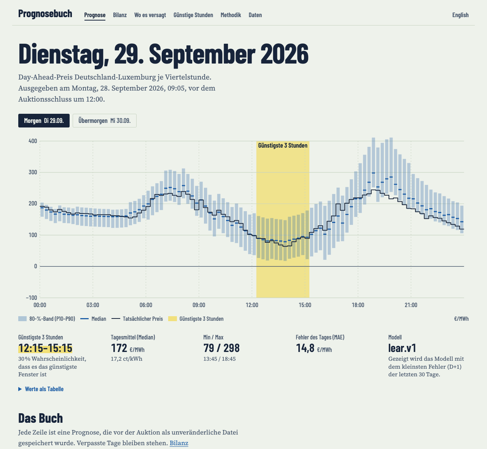

# Prognosebuch

**How well can German day-ahead electricity prices (DE-LU) be forecast for tomorrow and
the day after — and how reliable is a model compared with simple rules of thumb, measured
on real days?**

**Live:** https://tojacob03.github.io/Prognosebuch/ (Deutsch) · https://tojacob03.github.io/Prognosebuch/en/ (English)

Prognosebuch ("forecast ledger") publishes a probabilistic forecast (P10/P50/P90, 15-minute
resolution) every morning, **before** the auction results are published. Each forecast is
committed as an immutable file, scored automatically against the real prices, and added to a
public track record. Missed days count and stay visible.



*Screenshot of a local preview built from past days re-run with the live code (not live
forecasts). The live page looks the same once forecasts exist.*

> Status: live since 2026-09-30. There are no live results yet — accuracy numbers will appear
> here once they exist. No model is praised before the live record supports it.

## Backtest (not the track record)

A rolling backtest over 363 past target days (2025-10-01 to 2026-09-28), re-running the same
code with only the data known on each day. **It is not pre-registered and therefore optimistic;
it is shown only to explain why a model runs live.**

| Model | MAE D+1 | Skill D+1 | Pinball D+1 | MAE D+2 | Skill D+2 | 80 % band coverage (D+1 / D+2) |
|---|---|---|---|---|---|---|
| `gbm.v1` | 19.3 | +0.41 | 6.4 | 21.8 | +0.43 | 0.78 / 0.78 |
| `lear.v1` | 22.0 | +0.33 | 7.6 | 29.2 | +0.23 | 0.76 / 0.76 |
| `naive_last_day.v1` | 30.2 | +0.07 | 11.0 | 38.5 | −0.02 | 0.77 / 0.77 |
| `naive_similar_day.v1` (reference) | 32.7 | 0 | 12.0 | 37.9 | 0 | 0.76 / 0.76 |
| `naive_weekly.v1` | 37.8 | −0.16 | 13.5 | 37.8 | 0.00 | 0.77 / 0.76 |

MAE and pinball in EUR/MWh per quarter-hour; skill = 1 − MAE/MAE(reference). All bands are
somewhat too narrow (0.76–0.78 instead of 0.80); the raw quantile regression of `gbm.v1` covered
only 0.58 before conformal calibration. The last 30 days of the period were much harder (gbm.v1
MAE D+1 35.3, coverage 0.68). Details: [`backtest/2025-10-01_2026-09-28/`](backtest/2025-10-01_2026-09-28/).
Reproduce with `uv run prognosebuch backtest --first 2025-10-01 --last 2026-09-28`.

## How it works

| When (Europe/Berlin) | Job | What happens |
|---|---|---|
| ~09:00 day D | `forecast` | Fetch prices known up to the end of D, issue D+1 and D+2, commit to `forecasts/` (additions only) |
| 12:00 | — | Auction gate closure: hard deadline, later forecasts are refused |
| ~12:45 | — | Results for D+1 published by the exchange, then by SMARD.de |
| afternoon | `evaluate` | Update `actuals/`, score every due forecast, record missed ones, update `scores/summary.json` |
| hourly | `probe` | Log when SMARD forecast series become available (branch `probe`) |
| always | `clock` | Waits for the timetable and dispatches the jobs above on time (GitHub's cron proved unreliable, see [`INCIDENTS.md`](INCIDENTS.md)) |
| every push + daily | `ci` | Lint, types, offline tests, audit: no forecast file was ever modified or deleted |

Honesty rules enforced in code: forecasts only between 08:45 and 12:00 local time; refused if
SMARD already shows prices for D+1; models only receive an information set that is
hard-cut at the end of D (a CI test tampers with all later prices and checks the forecast is
unchanged); files are opened in exclusive-create mode; every manifest stores data cutoffs,
code commit, workflow run and the SHA-256 of the forecast file.

## Models

| Model | Rule |
|---|---|
| `naive_last_day.v1` | Same quarter-hour on the last known day (D) |
| `naive_weekly.v1` | Same quarter-hour one week before the target day |
| `naive_similar_day.v1` | Reference for skill scores (Lago et al. 2021): Mon/Sat/Sun from one week before, Tue–Fri from the last known day |
| `lear.v1` | Lasso-estimated autoregression per hour (after Lago et al. 2021) on lagged prices and calendar, three calibration windows, re-estimated daily |
| `gbm.v1` | Gradient boosting with quantile loss (P10/P50/P90) on weather forecasts (Open-Meteo, lead 2–3 days), lagged prices and calendar, re-estimated weekly |

Bands of the naive models and LEAR come from each model's own errors over the previous 60–90
days, per local hour and horizon; `gbm.v1` has its own quantile models. Full details:
[`METHODOLOGY.md`](METHODOLOGY.md). The story behind it: [`CASE_STUDY.md`](CASE_STUDY.md).

## Related work

Free price forecasts for dynamic tariffs exist (e.g. Energyforecast.de, stroomprijsprognose.nl,
EpexPredictor), and so do open research pipelines (epftoolbox, an operational DE-LU pipeline by
Raab) and a forecasting benchmark with pre-submitted forecasts (Energy-Arena). As far as I could
find, the consumer sites show no checkable track record and the open-source projects report
backtests. Prognosebuch combines both in one repository: every forecast is committed as an
immutable file before the auction, scored automatically against rules of thumb (including missed
days and Diebold-Mariano tests), and turned into a clearly labelled hint on the cheapest hours,
with open data.

## Limitations

- No gas or CO₂ prices (no openly licensed source); fuel-driven level shifts are only learned
  through lagged prices.
- No grid-operator load or renewable forecasts yet: SMARD keeps no vintages, so what was known at
  09:00 on past days is unknown. The hourly probe measures it first.
- Weather uses deliberately old model runs (48–72 h lead) so training and live match.
- Bands are estimated from the recent past and lag behind sudden changes in volatility.
- Extreme events (outages, market coupling incidents) are not predictable from these inputs.

## Data

- Forecasts, actuals and scores: see [`docs/DATA_FORMAT.md`](docs/DATA_FORMAT.md).
- Sources, licenses and known limitations: [`DATA_SOURCES.md`](DATA_SOURCES.md).
- Operational problems and missed days explained: [`INCIDENTS.md`](INCIDENTS.md).
- Price data: Bundesnetzagentur | SMARD.de, CC BY 4.0.

## Run locally

```bash
uv sync
uv run pytest                 # offline, uses a small real-data fixture
uv run prognosebuch audit     # verify the book
uv run prognosebuch evaluate  # fetch prices, score due days
```

## License

Code: MIT ([`LICENSE`](LICENSE)). Data: CC BY 4.0 ([`LICENSE-DATA.md`](LICENSE-DATA.md)).

**Not investment advice, not a trading signal, no promise of savings.** Forecasts are
uncertain by nature; the whole point of this project is to show how uncertain.
